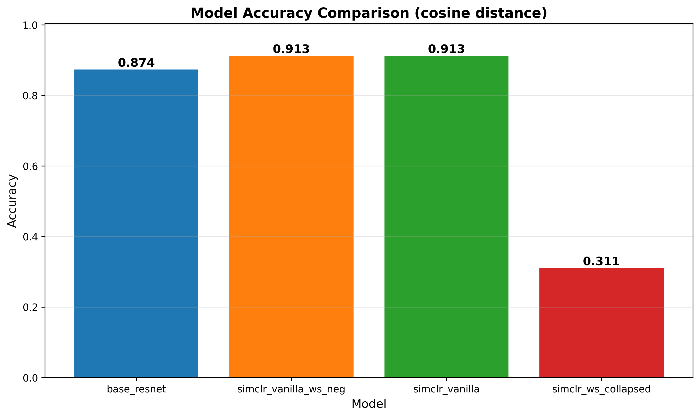
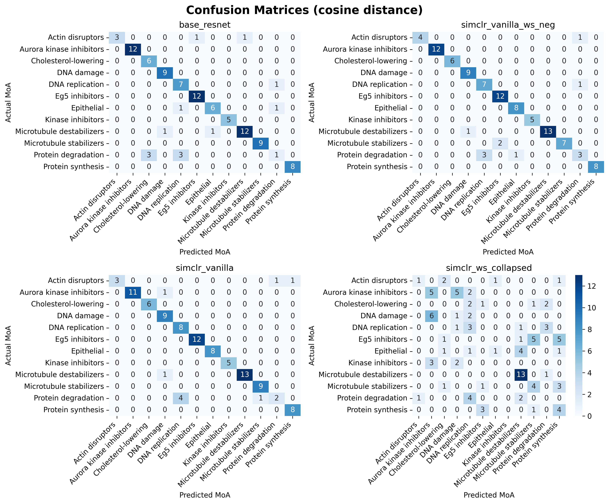
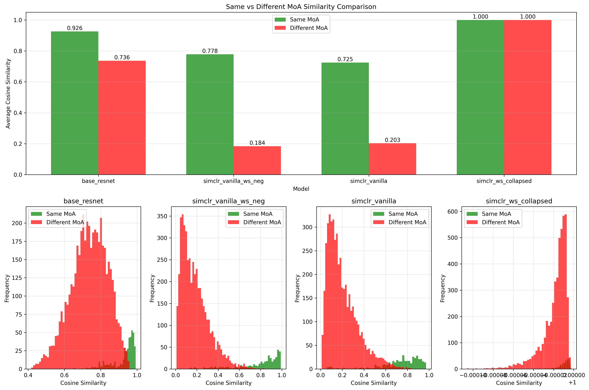
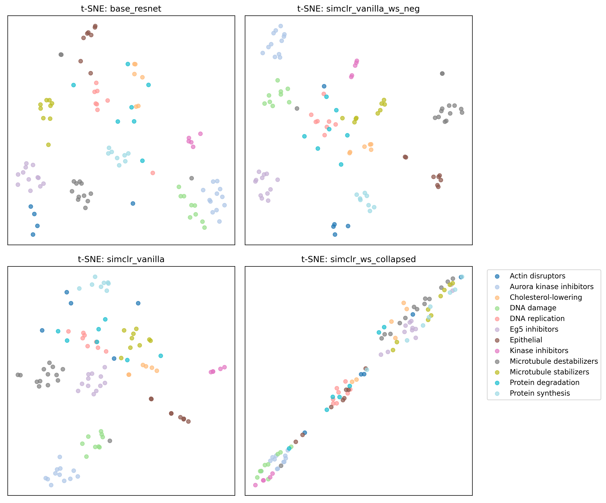

# Results

This section documents experimental results and analysis for compound profiling using different self-supervised learning approaches.

## Model Performance Comparison

The following plot shows the accuracy comparison between different models using cosine similarity as the distance metric:

## Confusion Matrices

Detailed confusion matrices for model evaluation. We show how treatments of each MOA are classified:

## Similarity Analysis

We compare similarity stats between same and different MOAs here:

## Dimensionality Reduction Visualization

t-SNE visualization comparing treatment embeddings from different models (Base ResNet, SimCLR variants, and WS-DINO):

